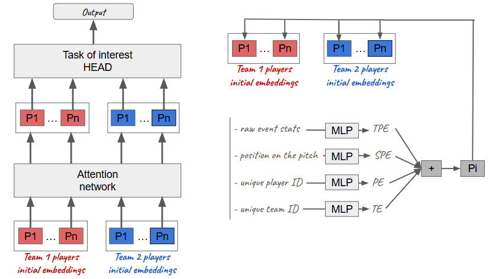
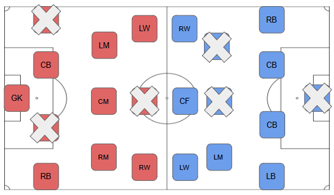

## RisingBALLER: A player is a token, a match is a sentence, A path towards a foundational model for football players data analytics

[ArXiv](https://arxiv.org/abs/2410.00943) | [RisB-Profiler](https://risb-profiler.streamlit.app/)

**Important Notice**

1. This code is designed for small-scale experiments. To scale up to large-scale training on massive datasets, certain aspects, particularly data processing and loading, should be optimized.

2. The code has been tested with Python 3.11.6, but it should work with Python versions >= 3.9 without issues. If you are using a different version of python, it's recommended to compile the [requirements.in](requirements.in) file yourself. First, install `pip-tools` using `pip install pip-tools`, then run `pip-compile requirements.in` to generate a `requirements.txt` file. Finally, install the dependencies from the compiled `requirements.txt` using `pip install -r requirements.txt`, instead of directly using my provided [requirements.txt](requirements.txt).

---

### Overview
RisingBALLER introduces a novel approach to modeling football players' performance data by treating players as tokens and matches as sentences. Trained with Masked Players Prediction, it captures contextual representations of football players, modeling their individual as well as their collective abilities. This repository provides the code for training the model, performing evaluations, and exploring applications.

---

### Table of Contents
1. [Getting Starting](#getting-starting)
2. [Masked Players Modeling](#masked-players-modeling)
3. [Applications](#applications)
4. [Next Match Statistics Prediction](#next-match-statistics-prediction)
5. [Citation](#citation)

---

#### Getting Starting
To get started, clone this repository and `cd risingballer`.

**Data**

I've provided the curated match dataframe extracted using the StatsBomb API with `Sbopen()`, available in the Python library `mplsoccer`. StatsBomb provides match event data in a timeline format (see their open repository), and I built a code snippet to convert this data into a player-level dataframe, [dataset/statsbomb](dataset/statsbomb/df_raw_counts_players_matches.csv). If you're interested in the code for this, please send me an [email](mailto:adjileyeb@yahoo.com)!.

Keep in mind that all you need to train a RisingBALLER model is mainly lineup data, along with some raw statistics (not necessarily all the statistics provided by StatsBomb). So, if you have other sources of massive football match lineups, with or without raw stats, you can quickly build a data preparation snippet and train a model. Don't forget to update the dataset config file in that case, the default config is [config/statsbomb_dataset](config/statsbomb_dataset/config.json) but you can save you own in [config/other_dataset](config/other_dataset).

I'm currently working on a pipeline for massive data collection to build a **larger foundational model**. If you're interested and would like to contribute, please send me an [email](mailto:adjileyeb@yahoo.com).

#### Masked Players Prediction (MPP)
The model is trained using masked players prediction, the same pretext task that has proven effective for text modeling in `BERT` and `RoBERTa`.

To run the masked players prediction on the provided StatsBomb dataset, use the following command: `python masked_players_prediction/train.py`

You can modified the training hyperparameters in the default config, the training outputs will be saved by default in [outputs](outputs/).

You also have a straightforward google colab notebooks for masked players prediction in [notebooks\train_masked_players_prediction.ipynb](notebooks\train_masked_players_prediction.ipynb).

#### Applications
RisingBALLER embeddings can be used out of the box for multiple applications.

The model I trained on the StatsBomb dataset provided player embeddings that were used to build the player retrieval app [RisB-Profiler](https://risb-profiler.streamlit.app/). The weights are available at [notebooks/pretrained_ckpt](notebooks/pretrained_ckpt/) alongside with the players and positions embeddings.

You can find a notebook on how to load the trained model embeddings (players, positions, teams) and use them out of the box for various applications in [notebooks/analyze_embeddings.ipynb](notebooks/analyze_embeddings.ipynb).

#### Next Match Statistics Prediction
Using a RisingBALLER backbone, you can fine-tune a model on various player, team, and match-level tasks. I introduced **next match statistics prediction** in the paper, demonstrating performance that outperforms a strong baseline in **10/16** statistics of interest. 

This task requires more data preparation, as you need to aggregate data from past matches to represent the temporal positional embeddings (see the architecture). The code and data used to reproduce the results presented in the paper will be added soon!

#### Citation 

If you used this work, please cite 

@misc{adjileye2024risingballerplayertokenmatch,
      title={RisingBALLER: A player is a token, a match is a sentence, A path towards a foundational model for football players data analytics}, 
      author={Akedjou Achraff Adjileye},
      year={2024},
      eprint={2410.00943},
      archivePrefix={arXiv},
      primaryClass={cs.LG},
      url={https://arxiv.org/abs/2410.00943}, 
}

